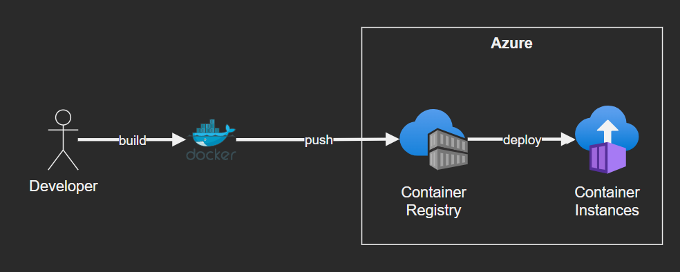

# Azure Docker app

A simple docker app that deploys a local Docker image to remote Azure Container Registry.



Requirements: .NET Core 6, Azure CLI, Docker

## Building your image

```bash
dotnet publish -c Release
docker build . --tag aspcontainers
```

To run your image locally:

```bash
docker run -d -p 5000:80 aspcontainers
```

## Publish to Azure

Steps to publish your built image to ACR and hosting on ACI.

Set the common environment variables (change values as you need):

```bash
# Create Azure Container Registry
export rg='rg-dotnetapp'
export acr='acrdotnetapp'
export aci='acidotnetapp'
export location='eastus'
```

Login to Azure, create the ACR and push the docker image:

```bash
# login to Azure from the CLI
az login

# create the resource group
az group create --name $rg --location $location --output Table

# create the container registry
az acr create --name $acr --resource-group $rg --sku Basic --output Table

# push to acr
az acr login --name $acr
docker tag aspcontainers "$acr.azurecr.io/aspcontainers"
docker push "$acr.azurecr.io/aspcontainers"
```

Get the and set it to a variable `export acrpass='<.....>'`

```bash
az acr update -n $acr --admin-enabled true
az acr credential show --name $acr --query "passwords[0].value"
```

Set the name for your container instance?

```bash
dns='yourappdns'
```

Finally, create your container instance:

```bash
az container create \
  --resource-group $rg \
  --name $aci \
  --image "$acr.azurecr.io/aspcontainers:latest" \
  --cpu 2 \
  --memory 2 \
  --registry-login-server "$acr.azurecr.io" \
  --registry-username $acr \
  --registry-password $acrpass \
  --dns-name-label $dns \
  --ports 80 \
  --location $location
```

Your application should be available at http://yourappdns.eastus.azurecontainer.io. 
To enable HTTPS for Container Instances in Production, [additional steps](https://docs.microsoft.com/en-us/azure/container-instances/container-instances-container-group-ssl) are required.


## Destroy the resources

Don't forget to clean your resources to avoid unwanted costs:

```bash
az group delete -n $rg
```